# Тестування працездатності системи за допомогою Postman та unittests

## Запуск системи

    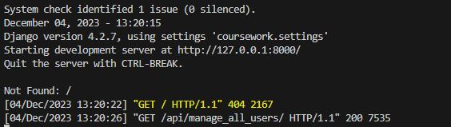

## Отримати усіх користувачів

    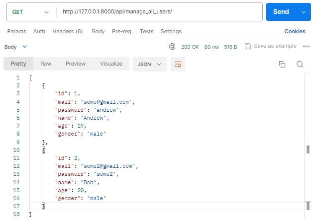

## Створити нового користувача

    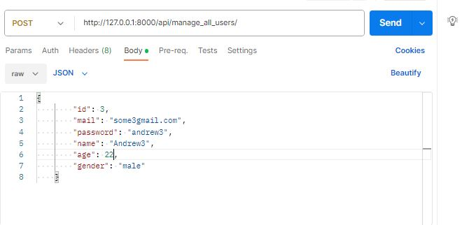

## Перевірка, що користувач був доданий

    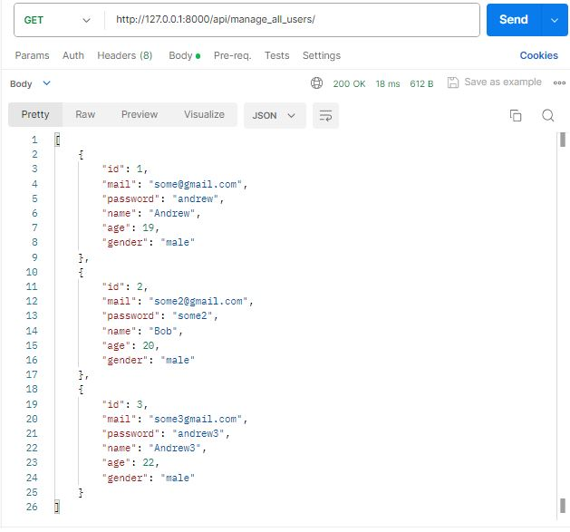

## Отримання користувача за id

    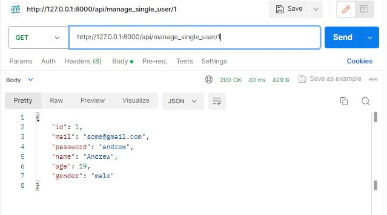

## Оновлення користувача за id 

    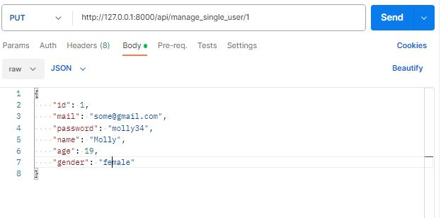

## Перевірка оновлення користувача

    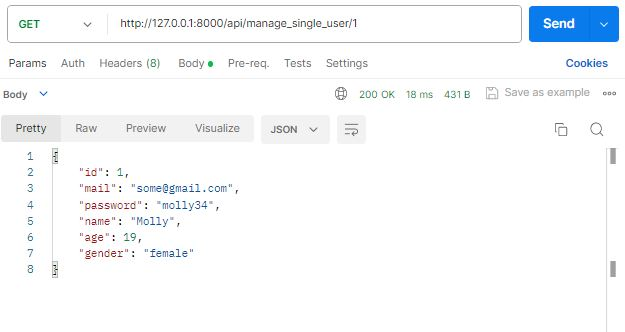

## Видалення користувача

    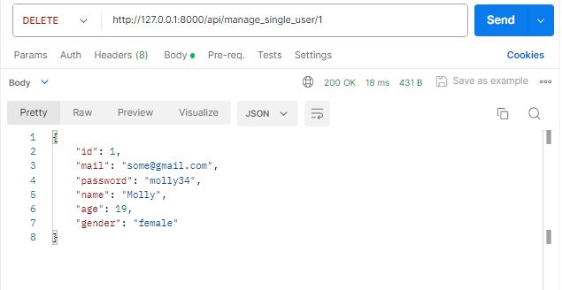

## Перевірка видалення користувача

    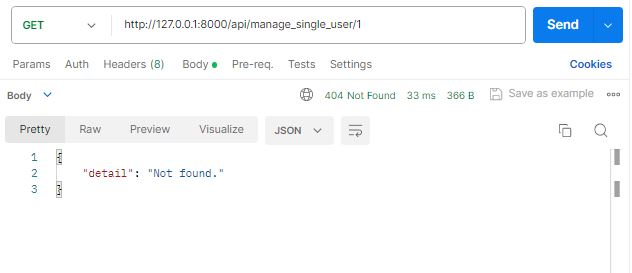

## Отримання всіх доступних ролей

    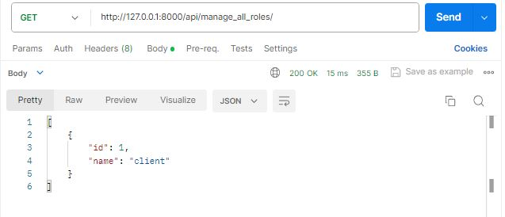

## Додати нову роль

    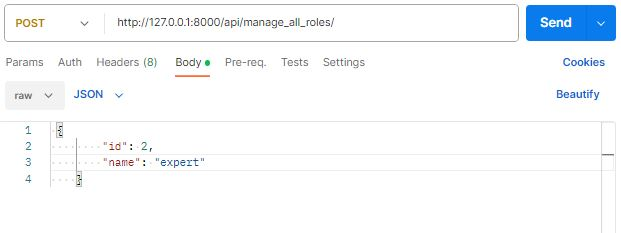

## Перевірка, що роль була додана

    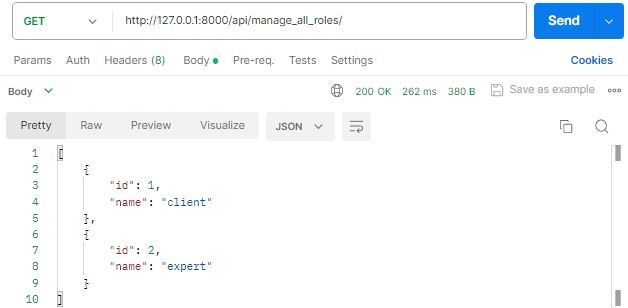

## Отримати усі гранти

    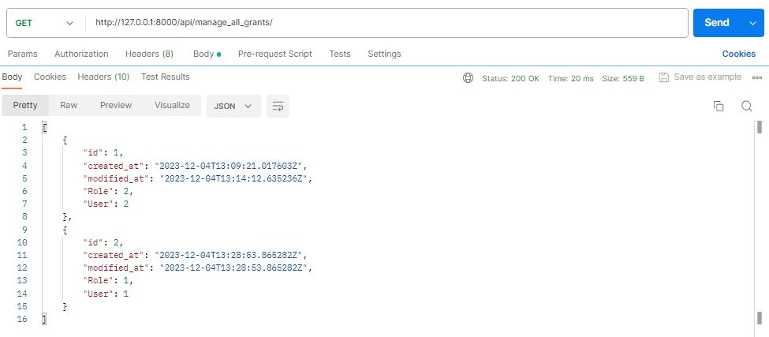

## Створити новий грант

    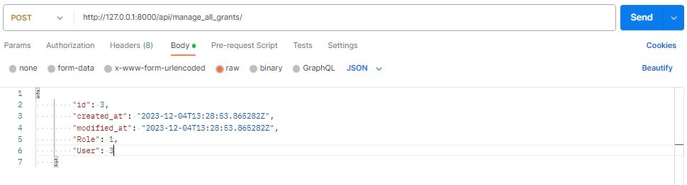

## Перевірка, що грант був доданий

    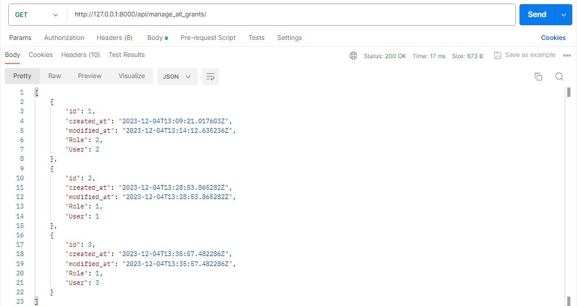

## Отримання гранту за id

    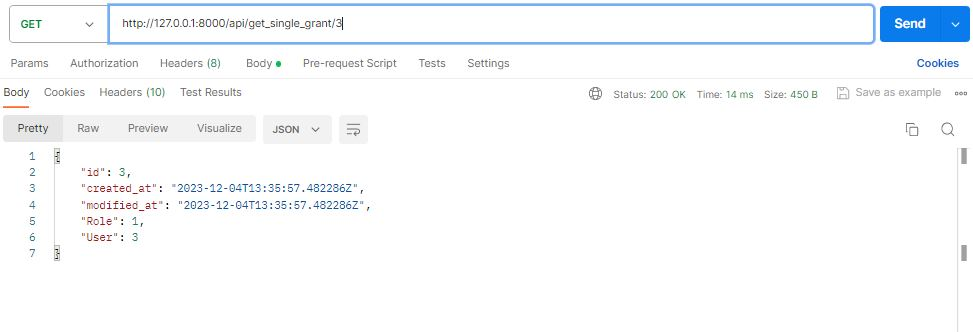

## Оновлення гранту за id 

    

## Перевірка оновлення гранту

    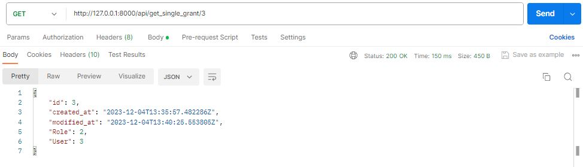

## Видалення гранту

    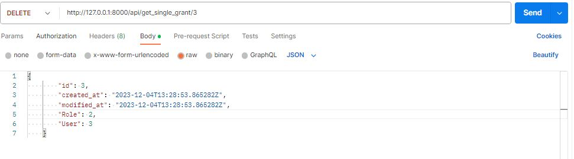

## Перевірка видалення гранту

    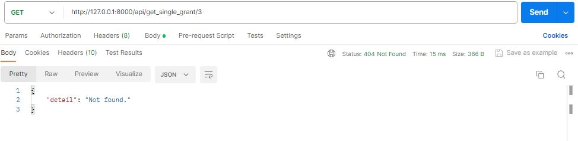

## Також для кращої перевірки роботи програми, були створені юніт-тести, які перевіряють усі сценарії

    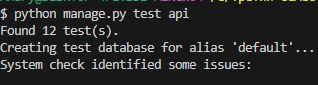

    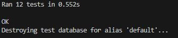

